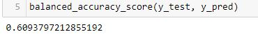

# Credit_Risk_Analysis

## Overview
The purpose of this analysis is to compare different models and determine which is most useful for using in loan/credit prediction analysis.

## Results

* RandomOverSampler
1. Balanced Accuracy Score: 0.53
2. Precision: 0.99
3. Recall: 0.37

* SMOTE
1. Balanced Accuracy Score: 0.53
2. Precision: 0.99
3. Recall: 0.41

* ClusterCentroids
1. Balanced Accuracy Score: 0.54
2. Precision: 0.99
3. Recall: 0.36

* SMOTEEN
1. Balanced Accuracy Score: 0.52
2. Precision: 0.99
3. Recall: 0.40

* BalancedRandomForestClassifier
1. Balanced Accuracy Score: 0.61
2. Precision: 0.99
3. Recall: 0.59

* EasyEnsembleClassifier
1. Balanced Accuracy Score: 0.61
2. Precision: 0.99
3. Recall: 0.59

## Summary:

In general the random undersampling provided by BalancedRandomForestClassifier and EasyEnsembleClassifier worked a better in terms of a higher accuracy score and higher recall when compared with the different sampling models. The precision is consistent throughout all models, which indicates that most of the data is classified as low risk. This makes me curious about the data quality and if the data is more skewed to represent too many low risk applications. Or potentially, the risk tolerance is quite low in this data set. 

As a result, I wouldn't recommend any of these algos, classifiers or models to use as I believe the data needs to be reviewed further and determined if there is an even balance between all representative data types. 